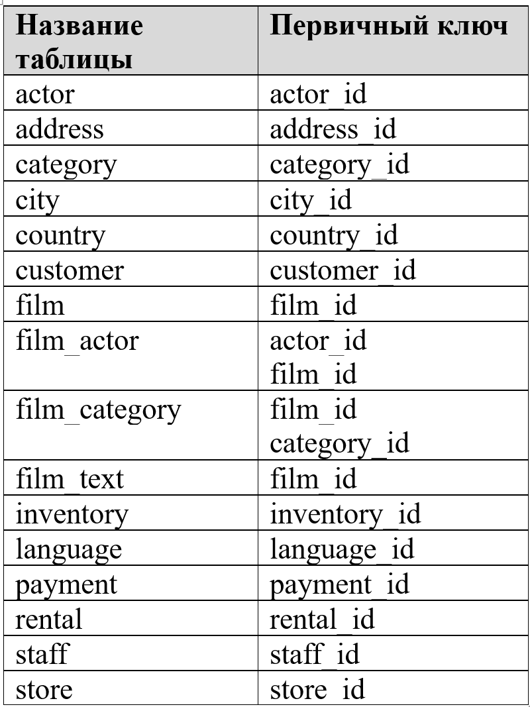

# Домашнее задание к занятию «Работа с данными (DDL/DML)» - Хрипун Алексей

---

## Задание 1

1.1. Поднимите чистый инстанс MySQL версии 8.0+. Можно использовать локальный сервер или контейнер Docker.

1.2. Создайте учётную запись sys_temp.

1.3. Выполните запрос на получение списка пользователей в базе данных. (скриншот)

1.4. Дайте все права для пользователя sys_temp.

1.5. Выполните запрос на получение списка прав для пользователя sys_temp. (скриншот)

1.6. Переподключитесь к базе данных от имени sys_temp.

Для смены типа аутентификации с sha2 используйте запрос:

```
ALTER USER 'sys_test'@'localhost' IDENTIFIED WITH mysql_native_password BY 'password';
```

1.6. По ссылке https://downloads.mysql.com/docs/sakila-db.zip скачайте дамп базы данных.

1.7. Восстановите дамп в базу данных.

1.8. При работе в IDE сформируйте ER-диаграмму получившейся базы данных. При работе в командной строке используйте команду для получения всех таблиц базы данных. (скриншот)

*Результатом работы должны быть скриншоты обозначенных заданий, а также простыня со всеми запросами.*


### Решение 1
Пользователь sys_temp создается командой:
```
CREATE USER 'sys_temp'@'localhost' IDENTIFIED BY 'P@ssw0rd';
```
Этому пользователю предоставляются все привилегии (в том числе и самому назначать привилегии другим пользователям
```
GRANT ALL PRIVILEGES ON *.* TO 'sys_temp'@'localhost' WITH GRANT OPTION; 
```
Список пользователей: 


Список прав для пользователя sys_temp:


Подключаемся к базе данных с помощью учетной записи sys_temp:


Восстанавливаем базу данных из дампа (нужно зайти в командный интерпретатор MySQL):
```
mysql> CREATE DATABASE sakila;
mysql> USE sakila;
mysql> source sakila-schema.sql;
mysql> source sakila-data.sql;
```
Схема восстановленной базы данных:


## Задание 2
Составьте таблицу, используя любой текстовый редактор или Excel, в которой должно быть два столбца: в первом должны быть названия таблиц восстановленной базы, во втором названия первичных ключей этих таблиц. Пример: (скриншот/текст)
```
Название таблицы | Название первичного ключа
customer         | customer_id
```

### Решение 2



## Задание 3
3.1. Уберите у пользователя sys_temp права на внесение, изменение и удаление данных из базы sakila.

3.2. Выполните запрос на получение списка прав для пользователя sys_temp. (скриншот)

*Результатом работы должны быть скриншоты обозначенных заданий, а также простыня со всеми запросами.*

### Решение 3
Права на добавление, внесение изменений и удаление данных выполняются командами:
```
REVOKE INSERT ON sakila.* FROM 'sys_temp'@'localhost';
REVOKE UPDATE  ON sakila.* FROM 'sys_temp'@'localhost';
REVOKE DELETE ON sakila.* FROM 'sys_temp'@'localhost';
```
Проверяем:
```
SELECT * FROM mysql.user WHERE user='sys_temp' AND host='localhost'\G;
```
 

