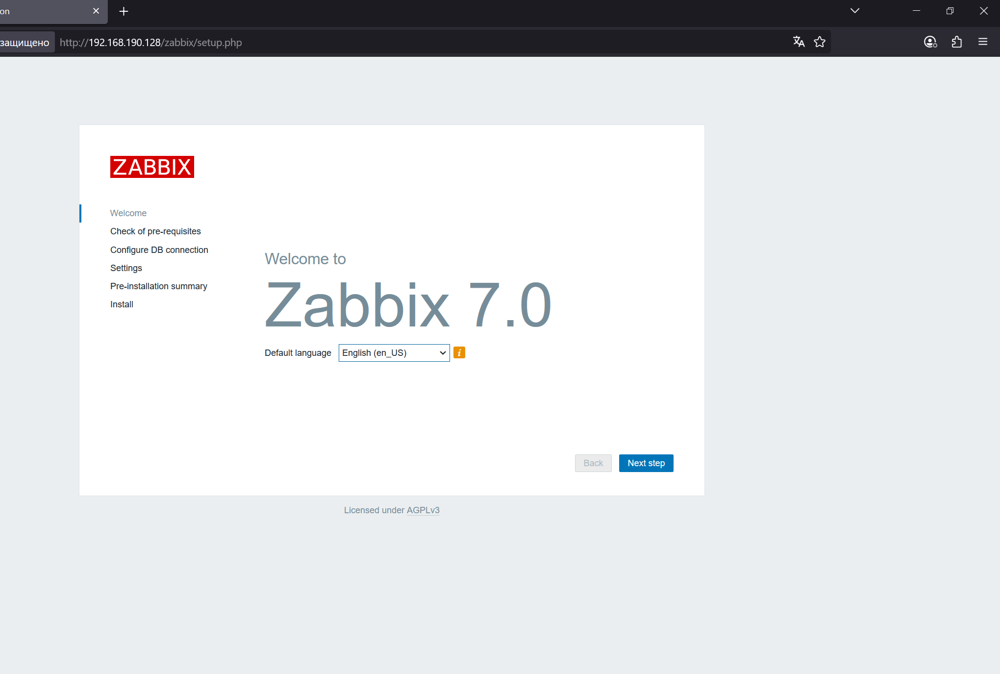
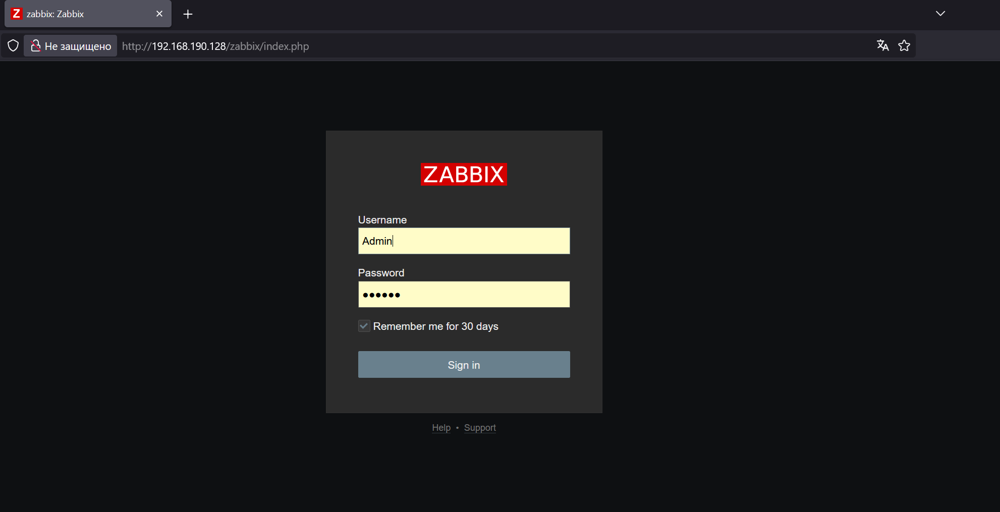
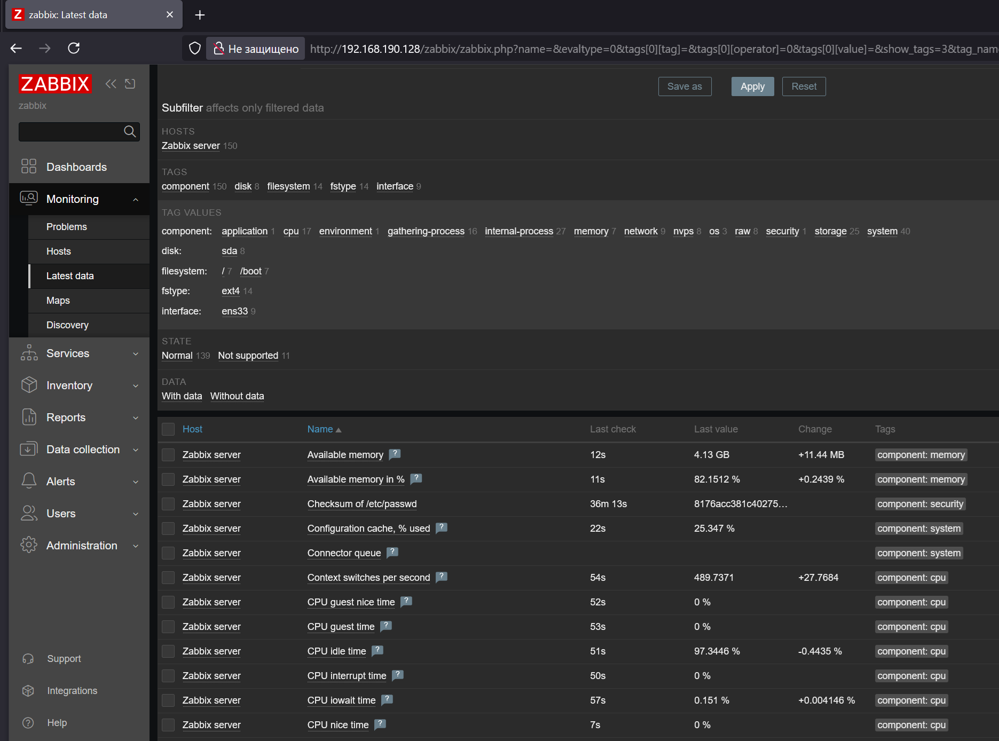
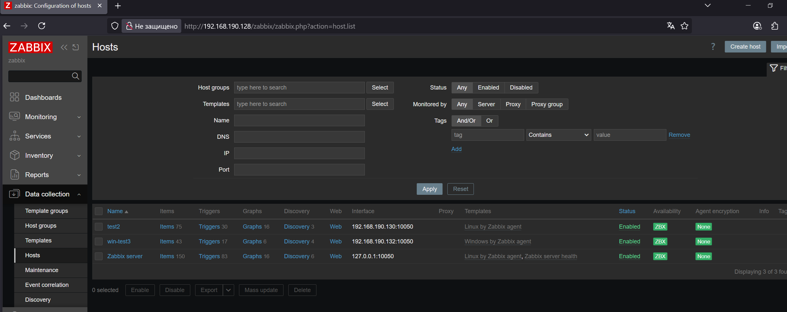
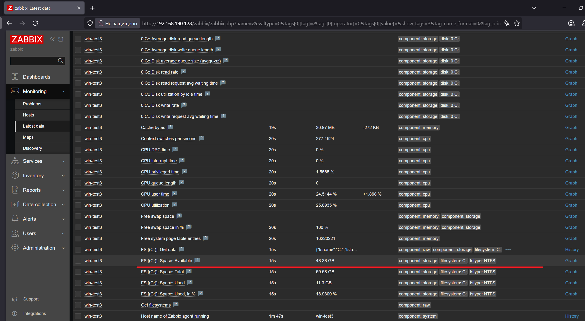
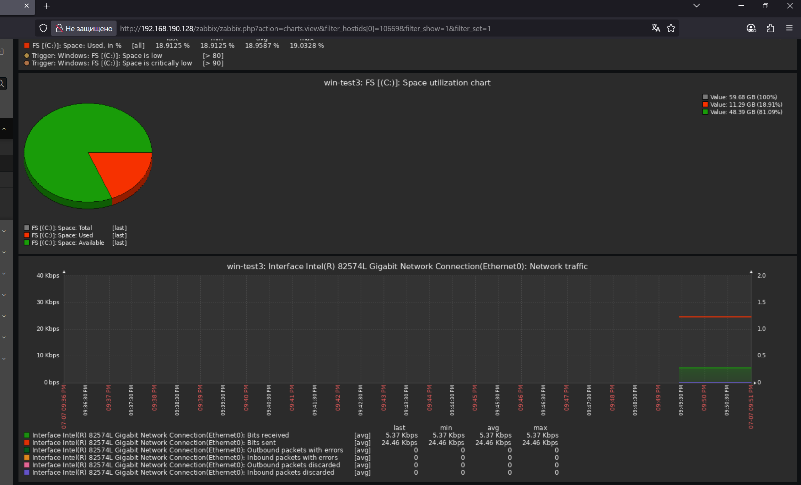

# Домашнее задание к занятию "`Система мониторинга Zabbix`" - `Хрипун Алексей`


### Инструкция по выполнению домашнего задания

   1. Сделайте `fork` данного репозитория к себе в Github и переименуйте его по названию или номеру занятия, например, https://github.com/имя-вашего-репозитория/git-hw или  https://github.com/имя-вашего-репозитория/7-1-ansible-hw).
   2. Выполните клонирование данного репозитория к себе на ПК с помощью команды `git clone`.
   3. Выполните домашнее задание и заполните у себя локально этот файл README.md:
      - впишите вверху название занятия и вашу фамилию и имя
      - в каждом задании добавьте решение в требуемом виде (текст/код/скриншоты/ссылка)
      - для корректного добавления скриншотов воспользуйтесь [инструкцией "Как вставить скриншот в шаблон с решением](https://github.com/netology-code/sys-pattern-homework/blob/main/screen-instruction.md)
      - при оформлении используйте возможности языка разметки md (коротко об этом можно посмотреть в [инструкции  по MarkDown](https://github.com/netology-code/sys-pattern-homework/blob/main/md-instruction.md))
   4. После завершения работы над домашним заданием сделайте коммит (`git commit -m "comment"`) и отправьте его на Github (`git push origin`);
   5. Для проверки домашнего задания преподавателем в личном кабинете прикрепите и отправьте ссылку на решение в виде md-файла в вашем Github.
   6. Любые вопросы по выполнению заданий спрашивайте в чате учебной группы и/или в разделе “Вопросы по заданию” в личном кабинете.
   
Желаем успехов в выполнении домашнего задания!
   
### Дополнительные материалы, которые могут быть полезны для выполнения задания

1. [Руководство по оформлению Markdown файлов](https://gist.github.com/Jekins/2bf2d0638163f1294637#Code)

---

### Задание 1

`Приведите ответ в свободной форме........`

1. `Перед установкой серверной части Zabbix должны быть установлены poatgesql и Apache:`
```
apt install postgresql apache2
```
2. `Далее нужно создать пользователя zabbix и базу данных zabbix в СУБД postgresql:`
```
su - postgres -c 'psql --command "CREATE USER zabbix WITH PASSWORD '\'p@ssw0rd\' ';" '
su - postgres -c 'psql --command "CREATE DATABASE zabbix OWNER zabbix;" '
```
3. `Теперь можно приступать к установке. Скачиваем и устанавливаем пакет для добавления репозитория Zabbix:`
```
wget https://repo.zabbix.com/zabbix/7.0/ubuntu/pool/main/z/zabbix-release/zabbix-release_latest_7.0+ubuntu24.04_all.deb
dpkg -i zabbix-release_latest_7.0+ubuntu24.04_all.deb
apt update
```
`И сама установка сервера Zabbix и веб-интерфейса (агент пока не устанавливаем):`
```
apt install zabbix-server-pgsql zabbix-frontend-php php8.3-pgsql zabbix-apache-conf zabbix-sql-scripts
```

4. `Импортируем начальную схему и данные в базу данных zabbix:`
```
zcat /usr/share/zabbix-sql-scripts/postgresql/server.sql.gz | sudo -u zabbix psql zabbix
```

5. `В файле /etc/zabbix/zabbix_server.conf указываем пароль для базы данных в строке DBPassword=`
6. `Перезапускаем службы и ставим на автозапуск:`
```
systemctl restart zabbix-server apache2
systemctl enable zabbix-server apache2 
```

`Теперь можно начинать первоначальную конфигурацию Zabbix-сервера`

`Пройдя все шаги, проходим аутентификацию по логину и паролю, которые установлены по умолчанию:`



---

### Задание 2

`Приведите ответ в свободной форме........`

1. `Чтобы установить агент на системе Linux, нужно добавить репозиторий zabbix (по аналогии с установкой серверной чести):
```
wget https://repo.zabbix.com/zabbix/7.0/ubuntu/pool/main/z/zabbix-release/zabbix-release_latest_7.0+ubuntu24.04_all.deb
dpkg -i zabbix-release_latest_7.0+ubuntu24.04_all.deb
apt update
```

2. `Далее устанавливаем на системах агент zabbix:`
```
apt install zabbix-agent
```
3. `Находим файл /etc/zabbx/zabbix_agentd.conf и в строке Server= указываем IP-адрес сервера Zabbix`
4. `На сервере Zabbix в конфигурационном файле zabbix_server.conf в параметре StatsAllowedIP нужно указать подсеть, из которой нужно принимать данные для монторинга:`
```
StatsAllowedIP=192.168.190.0/24,127.0.0.1
```
5. `В разделе Data collection добавляем хосты для мониторинга. Указываем шаблон Linux by Zabbix agent`





---

### Задание 3

`Приведите ответ в свободной форме........`

1. `Скачиваем архив с агентом для Windows с официального сайта Zabbix`
2. `На системе Windows в йонфигурационном файле zabbix_agent2.conf указываем IP-адрес сервера Zabbix и расположение лог-файла агента. 
устанавливаем агент как службу:`
```
zabbix_agent2.exe -i -c c:\zabbix\conf\zabbix_agent2.conf -S delayed
```
3. `Запускаем службу`
4. `На сервере Zabbix добавлям систему Windows для мониторинга (шаблон выбираем Windows by Zabbix agent)`






