# Домашнее задание к занятию `Домашнее задание к занятию 1 «Disaster recovery и Keepalived»` - Хрипун Алексей

---

### Задание 1
`Исходная схема`
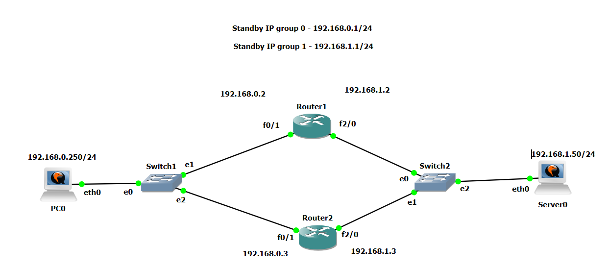

`На интерфейсах маршрутизатора настраиваем NHRP. Настройка Router1`

```
!
interface FastEthernet0/1
 ip address 192.168.0.2 255.255.255.0
 duplex auto
 speed auto
 standby version 2
 standby 0 ip 192.168.0.1
 standby 0 priority 105
 standby 0 preempt
 standby 0 track FastEthernet2/0
!
interface FastEthernet2/0
 ip address 192.168.1.2 255.255.255.0
 duplex auto
 speed auto
 standby version 2
 standby 1 ip 192.168.1.1
 standby 1 priority 50
 standby 1 preempt
 standby 1 track FastEthernet0/1
!
```
`Router 2:`
```
!
interface FastEthernet0/1
 ip address 192.168.0.3 255.255.255.0
 duplex auto
 speed auto
 standby version 2
 standby 0 ip 192.168.0.1
 standby 0 preempt
 standby 0 track FastEthernet2/0
!
interface FastEthernet2/0
 ip address 192.168.1.3 255.255.255.0
 duplex auto
 speed auto
 standby version 2
 standby 1 ip 192.168.1.1
 standby 1 preempt
 standby 1 track FastEthernet0/1
!
```
`Проверяем:`
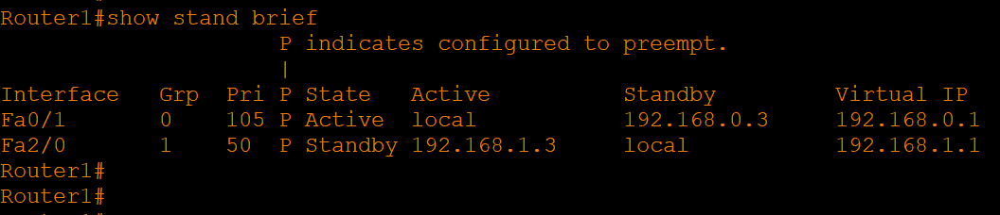
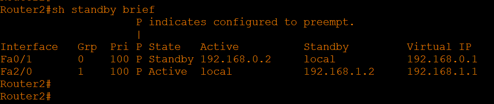

`Пустим ping от PC0 на Server0 и посмотрим трафик между Switch1 и Router1. Видим, что на Server0 идут только echo request`
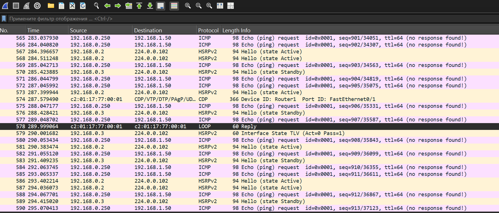

`Проверим трафик между Swith1 и Router2. Через него от Server0 возвращаются echo reply` 
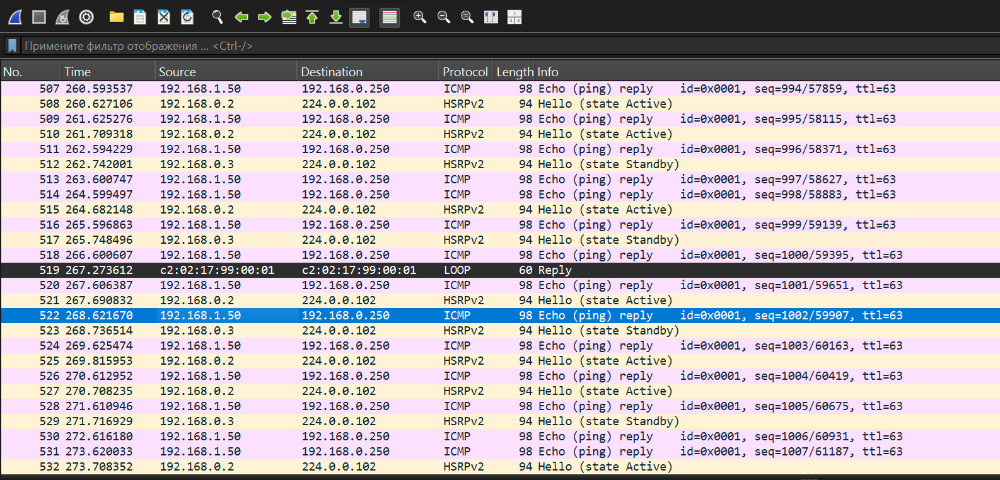

`Симитируем прерывание канала связи между Switch1 и Router1 и снова проверим трафик между Switch1 и Router2. Теперь весь трафик идет через Router2`
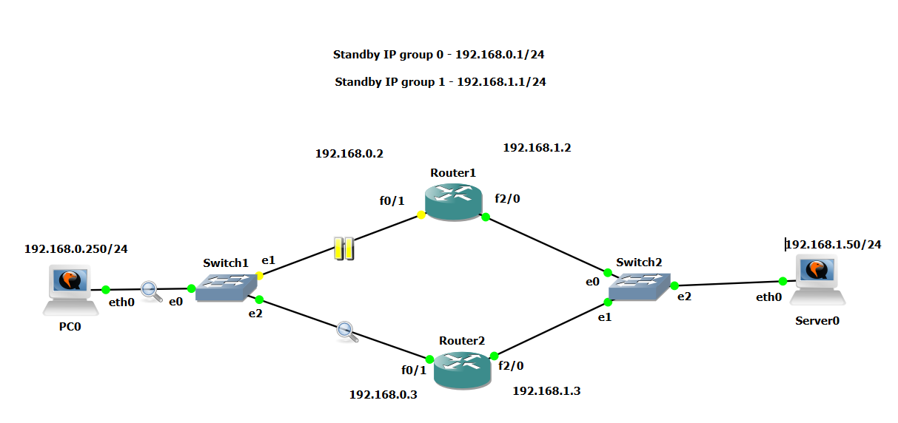
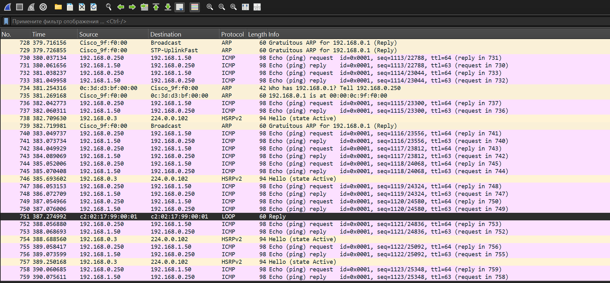
`На Router2 для обоих групп интерфейсы стали активными:`
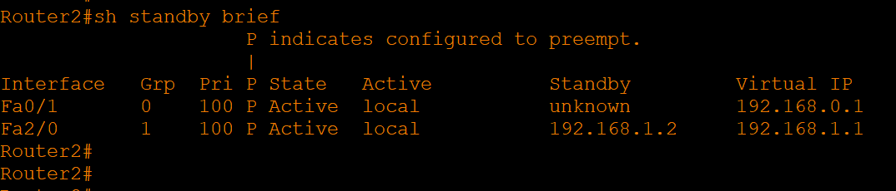

`После восстановления соединения между Switch1 и Router1 для группы 0 Router1 снова становится активным (команда preempt и более высокий приоритет)`

---

### Задание 2

`BASH скрипт для проверки подключения к порту 80 и наличия файла index.html:`
```
#!/bin/bash
nc -z -w 3 127.0.0.1 80 && check=0 || check=1
echo "$check"

if [[ -f /var/www/html/index.html ]] && [[ "$check" == 0 ]]; then
        echo "OK"
else
        exit 1
fi
```
`На серверах устанавливаем nginx и keepalived. На обоих серверах настраиваем keepalive. Один из серверов MASTER, второй BACKUP:`
```
/var/www/test_nginx.sh


global_defs {
    enable_script_security
}

vrrp_script test_nginx {
    script "/var/www/test_nginx.sh"
    interval 3
    user www-data

}

vrrp_instance N1 {
    state MASTER
    interface ens33
    virtual_router_id 150
    priority 255
    advert_int 1
    authentication {
        auth_type PASS
        auth_pass p@ssword
    }
    virtual_ipaddress {
        192.168.190.150
    }
    track_script {
        test_nginx
    }
} 
```
`BACKUP:`

```
global_defs {
    enable_script_security
}

vrrp_script test_nginx {
    script "/var/www/test_nginx.sh"
    interval 3
    user www-data

}

vrrp_instance N1 {
    state BACKUP
    interface ens33
    virtual_router_id 150
    priority 100
    advert_int 1
    authentication {
        auth_type PASS
        auth_pass p@ssword
    }
    virtual_ipaddress {
        192.168.190.150
    }
    track_script {
        test_nginx
    }
}
```

`Проверяем доступность по всем трем адресам:`

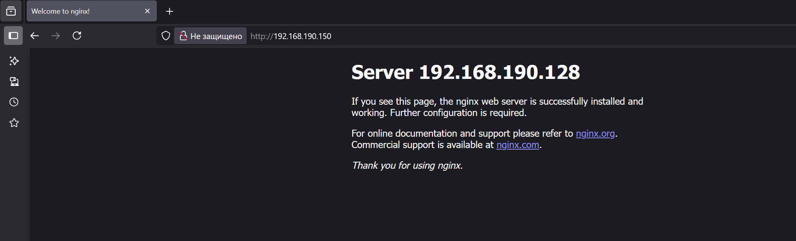
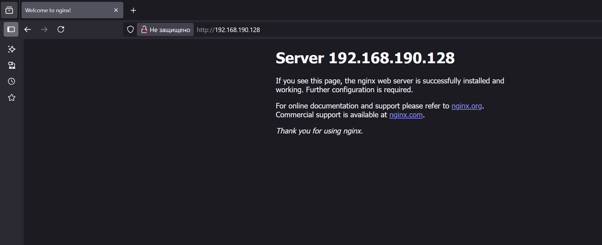


`На сервере 192.168.190.128 (это MASTER) останавливаем nginx и проверяем доступность сервера:`

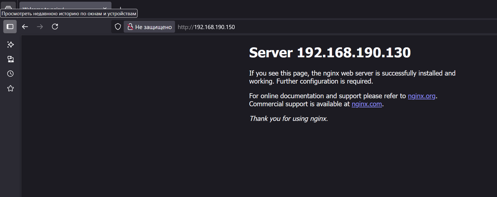

`Переключение произошло. При недоступности файла /var/www/html/index.html также происходит переключение`

---

### Задание 3
`Создадим скрипт, который проверяет параметр системы load average за 1 минуту. На серверах устанволен приоритет 160 (на самом мощном), 150 на втором и 145 третьем. Поэтому в скрипте установлено максимальное значение средней загрузки в 140. При превышении этого порога (не важно на сколько) VIP (virtual ip) переместится на другой сервер`
```
#!/bin/bash
load=$(cat /proc/loadavg | cut -d ' ' -f 1)
load=${load%.*}
if [[ $load -ge 140 ]]; then
        let final=140
        echo "$final" > /var/www/load_average.txt
else
        echo "$load" > /var/www/load_average.txt
fi
```
`Нужно не забыть сделать скрипт исполняемым и добавить скрипт в cron (командой crontab -e):`
```
*/1 * * * *  /etc/keepalived/test_load_average.sh
```
`Теперь нужно добавить файл /var/www/load_average.txt для отслеживания в keepalived.conf (вес указываем -1, т.к. значение нужно вычитать из заданного приоритета):`
```
global_defs {
    enable_script_security
}

vrrp_script test_nginx {
    script "/var/www/test_nginx.sh"
    interval 3
    user www-data

}

vrrp_track_file load_average {
    file /var/www/load_average.txt
}


vrrp_instance N1 {
    state BACKUP
    interface ens33
    virtual_router_id 150
    priority 160
    advert_int 1
    authentication {
        auth_type PASS
        auth_pass p@ssword
    }
    virtual_ipaddress {
        192.168.190.150
    }
    track_script {
        test_nginx
    }
    track_file {
        load_average weight -1
    }

}

```  
`Делаем аналогичные шаги на двух других серверах.`
`Проверяем доступность сайта на всех четырех адресах`
`Теперь утилитой stress-ng подаем нагрузку на первый сервер. Через какое-то время его приоритет падает, и VIP переходит на сервер test1:`
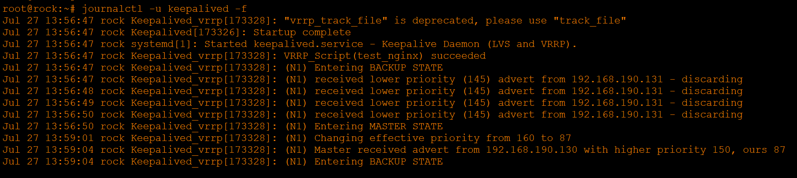


`Подаем нагрузку на второй сервер (test1) и через какое-то время его приоритет также падает и VIP переходит на третий сервер:`
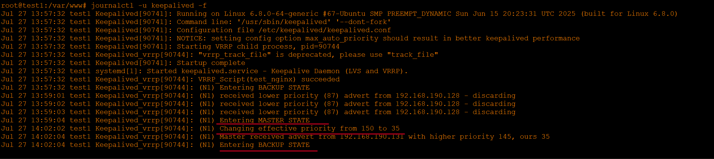

`Снимаем нагрузку с первого сервера. Его приоритет начинает расти, и через какое-то время он забирает роль MASTER по приоритету у сервера test3:`
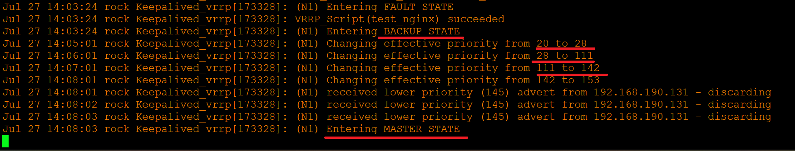
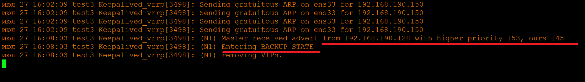

---

