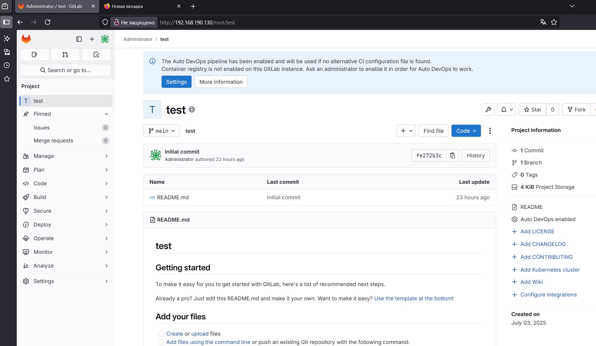
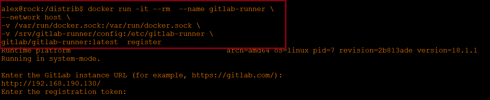
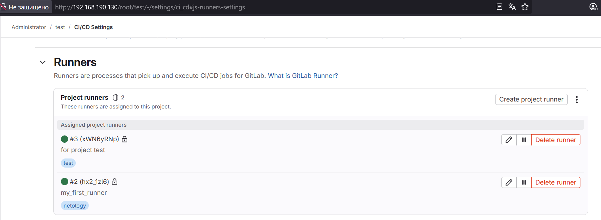
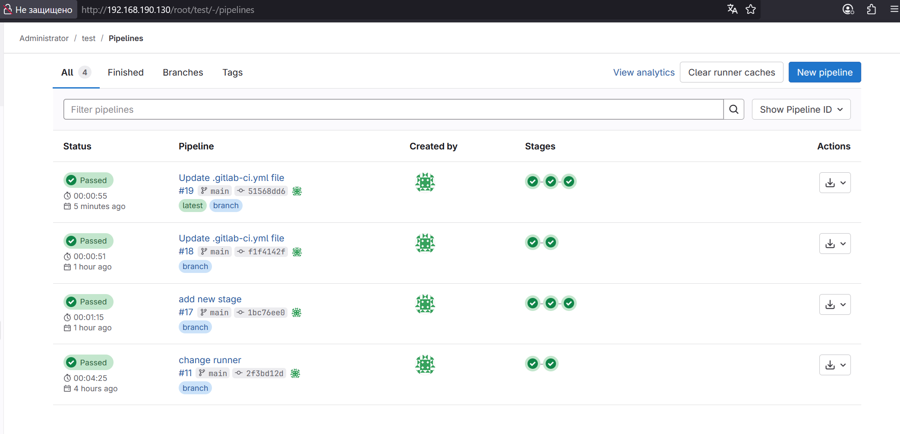

# Домашнее задание к занятию "`GitLab`" - `Хрипун Алексей`


### Инструкция по выполнению домашнего задания

   1. Сделайте `fork` данного репозитория к себе в Github и переименуйте его по названию или номеру занятия, например, https://github.com/имя-вашего-репозитория/git-hw или  https://github.com/имя-вашего-репозитория/7-1-ansible-hw).
   2. Выполните клонирование данного репозитория к себе на ПК с помощью команды `git clone`.
   3. Выполните домашнее задание и заполните у себя локально этот файл README.md:
      - впишите вверху название занятия и вашу фамилию и имя
      - в каждом задании добавьте решение в требуемом виде (текст/код/скриншоты/ссылка)
      - для корректного добавления скриншотов воспользуйтесь [инструкцией "Как вставить скриншот в шаблон с решением](https://github.com/netology-code/sys-pattern-homework/blob/main/screen-instruction.md)
      - при оформлении используйте возможности языка разметки md (коротко об этом можно посмотреть в [инструкции  по MarkDown](https://github.com/netology-code/sys-pattern-homework/blob/main/md-instruction.md))
   4. После завершения работы над домашним заданием сделайте коммит (`git commit -m "comment"`) и отправьте его на Github (`git push origin`);
   5. Для проверки домашнего задания преподавателем в личном кабинете прикрепите и отправьте ссылку на решение в виде md-файла в вашем Github.
   6. Любые вопросы по выполнению заданий спрашивайте в чате учебной группы и/или в разделе “Вопросы по заданию” в личном кабинете.
   
Желаем успехов в выполнении домашнего задания!
   
### Дополнительные материалы, которые могут быть полезны для выполнения задания

1. [Руководство по оформлению Markdown файлов](https://gist.github.com/Jekins/2bf2d0638163f1294637#Code)

---

### Задание 1

`Приведите ответ в свободной форме........`

1. `В соответствии с инструкцией https://docs.gitlab.com/install/package/ubuntu/?tab=Community+Edition устанавливаем GitLab на виртуальную машину Ubuntu`
2. `Создаем новый проект и пустой репозиторий`

3. `Запускаем уоманду регистрации runner и производим регистрацию runner`

   `Запускаем зарегистрированный runner командой:` 

```
docker run -d --rm  --name gitlab-runner --network host -v /var/run/docker.sock:/var/run/docker.sock -v /srv/gitlab-runner/config:/etc/gitlab-runner gitlab/gitlab-runner:latest
```




---

### Задание 2

`Приведите ответ в свободной форме........`

1. `Клонируем репозиторий https://github.com/netology-code/sdvps-materials/tree/main/gitlab на промежуточную машину. На этой машине подключаем внешний репозиторий GitLab:`
```
git remote add netology http://192.168.190.130/root/test.git
```
`Сонхронизируемся с удаленным репозиторием (git pull netology)`
`Копируем содержимое репозитория с Github в промежуточный, коммитим новые файлы и отправляем их в репозиторий GitLab`
```
git add .
git status
git commit -am "new1"
git push netology
```
 

2. `Создаем файл .gitlab-ci.yml file. Здесь стадии test и build зависят от compile, и после того, как compile отработает, обе stage запускаются одновременно`
```
stages:
  - compile
  - test
  - build

compile:
  stage: compile
  before_script:
      - echo "Hello  " | tr -d "\n" > file1.txt
      - echo "world" > file2.txt
  script: cat file1.txt file2.txt > compiled.txt
  artifacts:
    paths:
    - compiled.txt
    expire_in: 20 minutes
  tags: 
    - test

test:
  stage: test
  image: golang:1.17
  script:
    - go test .
  tags:
    - netology
  needs: ["compile"]

build:
  stage: build
  image: docker:latest
  script:
    - docker build .
  tags:
    - test
  needs: ["compile"]
```




---
