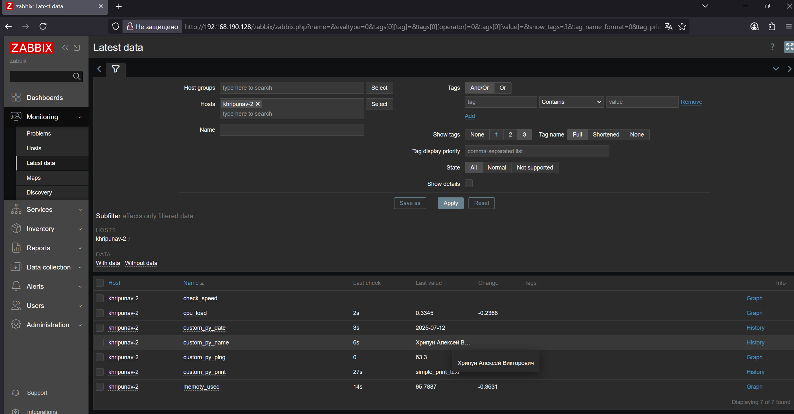

# Домашнее задание к занятию "`Система мониторинга Zabbix.Часть 2.`" - Хрипун Алексей

---

### Задание 1


---

### Задание 2 и задание 3


---

### Задание 4


---

### Задание 5


---

### Задание 6

Код скрипта
```
#!/bin/bash
if [ $1 -eq 1 ]; then
        echo "Хрипун Алексей Викторович"
elif [ $1 -eq 2 ]; then
        echo "$(date '+%d-%m-%Y')"
else
        echo "$1 - Неверный аргумент. Нужно ввести 1 или 2"
fi
```


---
### Задание 7

Код скрипта Python:

```
#!/usr/bin/python3
import sys
import os
import re
from datetime import date
if (sys.argv[1] == '-ping'): # Если -ping
    result=os.popen("ping -c 1 " + sys.argv[2]).read() # Делаем пинг по заданному адресу
    result=re.findall(r"time=(.*) ms", result) # Выдёргиваем из результата время
    print(result[0]) # Выводим результат в консоль
elif (sys.argv[1] == '-simple_print'): # Если simple_print
    print(sys.argv[2]) # Выводим в консоль содержимое sys.arvg[2]
elif (sys.argv[1] == '1'):
    print("Хрипун Алексей Викторович")
elif (sys.argv[1] == '2'):
    print(date.today())
else: # Во всех остальных случаях
    print(f"unknown input: {sys.argv[1]}") # Выводим непонятый запрос в консоль
```



### Задание 8


