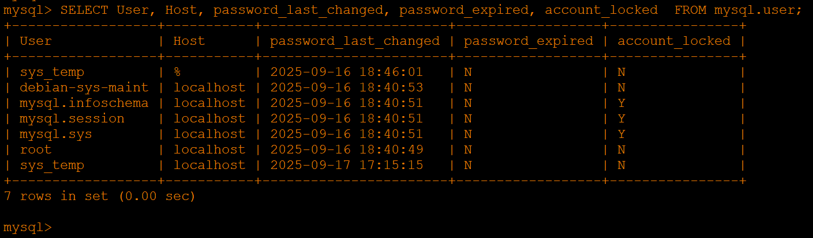

# Домашнее задание к занятию 3 «Резервное копирование» - Хрипун Алексей

---

### Задание 1


`Если из домашнего каталога удалить файл, например, file.test, в новой резервной копии его также не будет:`


 

### Задание 2

`Скрипт для ежедневного резервного копирования домашнего каталога. Для удобства мониторинга задания лог пишется не только в системный журнал, но и в отдельный лог-файл:`
```
#!/bin/bash
rsync -a --delete --checksum /home/fox/ /tmp/backup
if [[ $? -eq 0 ]]; then
        echo "$(date +"%Y-%m-%dT%H:%M:%S.%6N")       $HOSTNAME   Backup for the fox user has been completed" | tee -a /var/log/syslog  >> /var/log/backup_home_fox.txt
else
        echo "$(date +"%Y-%m-%dT%H:%M:%S.%6N")       $HOSTNAME   Backup FAILED for the fox user" | tee -a /var/log/syslog >> /var/log/backup_home_fox.txt
fi
```


`Результат выполнения скрипта пишется в лог-файлы. При одном из запусков быз изменен каталог для копирования. Неудачный запуск также попал в лог файлы:`


`После отладки скрипта он был поставлен на ежедневное выполнение с помощью cron`


[Запуск по расписанию](https://github.com/kumpelalex111/cicd-47/blob/main/root)


### Задание 3


### Задание 4
`Конфигурационный файл HAProxy с разными backends:`
```

