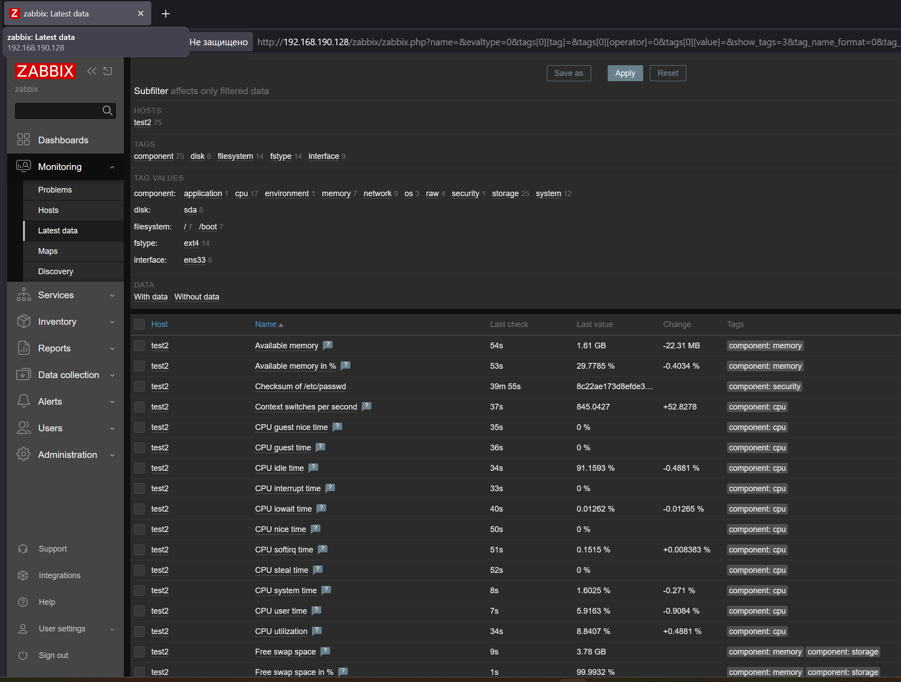

# Домашнее задание к занятию "`Система мониторинга Zabbix.Часть 2.`" - Хрипун Алексей

---

### Задание 1


---

### Задание 2

`Приведите ответ в свободной форме........`

1. `Чтобы установить агент на системе Linux, нужно добавить репозиторий zabbix (по аналогии с установкой серверной чести.):`
```
wget https://repo.zabbix.com/zabbix/7.0/ubuntu/pool/main/z/zabbix-release/zabbix-release_latest_7.0+ubuntu24.04_all.deb
dpkg -i zabbix-release_latest_7.0+ubuntu24.04_all.deb
apt update
```

2. `Далее устанавливаем на системах агент zabbix:`
```
apt install zabbix-agent
```
3. `Находим файл /etc/zabbx/zabbix_agentd.conf и в строке Server= указываем IP-адрес сервера Zabbix`
4. `На сервере Zabbix в конфигурационном файле zabbix_server.conf в параметре StatsAllowedIP нужно указать подсеть, из которой нужно принимать данные для монторинга:`
```
StatsAllowedIP=192.168.190.0/24,127.0.0.1
```
5. `В разделе Data collection добавляем хосты для мониторинга. Указываем шаблон Linux by Zabbix agent`





---

### Задание 3

`Приведите ответ в свободной форме........`

1. `Скачиваем архив с агентом для Windows с официального сайта Zabbix`
2. `На системе Windows в конфигурационном файле zabbix_agent2.conf указываем IP-адрес сервера Zabbix и расположение лог-файла агента. 
Устанавливаем агент как службу:`
```
zabbix_agent2.exe -i -c c:\zabbix\conf\zabbix_agent2.conf -S delayed
```
3. `Запускаем службу`
4. `На сервере Zabbix добавлям систему Windows для мониторинга (шаблон выбираем Windows by Zabbix agent)`


