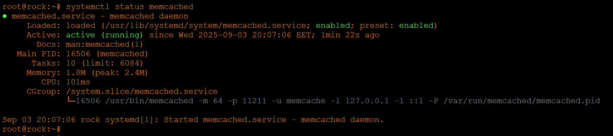
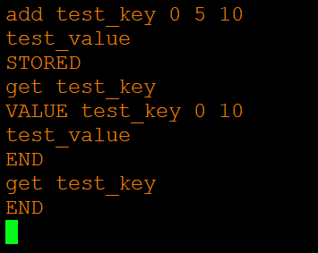
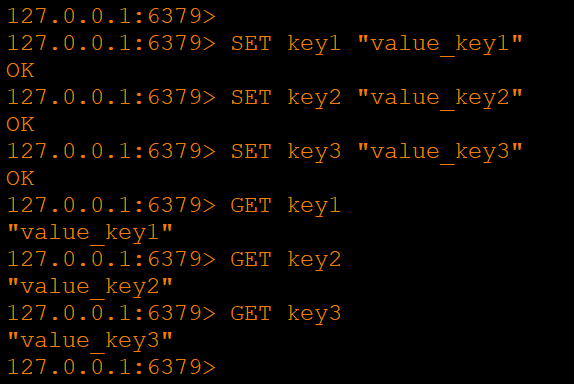
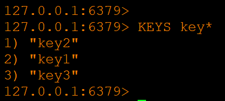
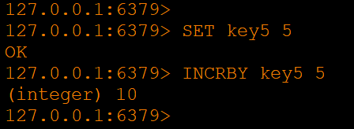

# Домашнее задание к занятию «Кеширование Redis/memcached» - Хрипун Алексей

---

## Задание 1. Кеширование
Приведите примеры проблем, которые может решить кеширование.

Приведите ответ в свободной форме.

### Решение 1
Кеширование используется для увеличения скорости загрузки страниц, уменьшения нагрузки на ресурс, уменьшения времени получения данных.
Например,SQL Server кэширует планы запросов. При первом выполнении SQL Server анализирует запрос, генерирует план выполнения. При повторном выполнении того же запроса, запрос будет взят из кэша, и не придется снова строить план запроса.
Или, например, запросы DNS кешируются, чтобы не приходилось снова и снова разрешать через цепочки DNS-серверов одни и те же DNS-имена.

## Задание 2. Memcached
Установите и запустите memcached.

Приведите скриншот systemctl status memcached, где будет видно, что memcached запущен.

### Решение 2

## Задание 3. Удаление по TTL в Memcached
Запишите в memcached несколько ключей с любыми именами и значениями, для которых выставлен TTL 5.

Приведите скриншот, на котором видно, что спустя 5 секунд ключи удалились из базы.

### Решение 3

### Задание 4. Запись данных в Redis
Запишите в Redis несколько ключей с любыми именами и значениями.

Через redis-cli достаньте все записанные ключи и значения из базы, приведите скриншот этой операции.

### Решение 4

`Получить все имеющиеся ключи можно так:`

### Задание 5. Работа с числами
Запишите в Redis ключ key5 со значением типа "int" равным числу 5. Увеличьте его на 5, чтобы в итоге в значении лежало число 10.

Приведите скриншот, где будут проделаны все операции и будет видно, что значение key5 стало равно 10.

### Решение 5

