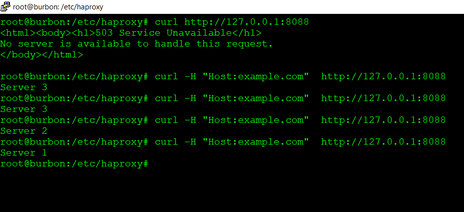
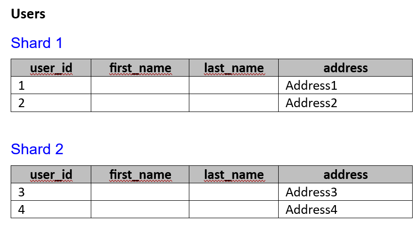
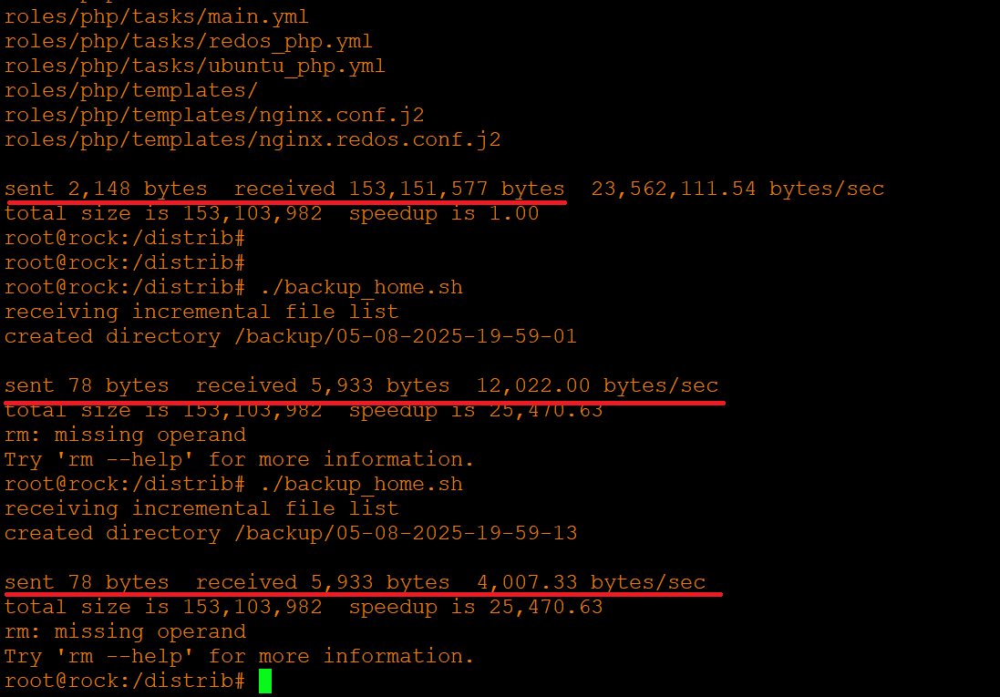

# Домашнее задание к занятию 2 «Кластеризация и балансировка нагрузки» - Хрипун Алексей

---

### Задание 1
`Конфигурация HAProxy для балансировки на 4 уровне OSI:`
```
listen web_example
        bind :5555
        server s1 127.0.0.1:7777 check inter 2s
        server s2 127.0.0.1:8888 check inter 2s
```


 

### Задание 2

`Конфигурационный файл HAProxy (в блоке listen stats настраиваем ведение статистики):`
```
listen stats
        bind            :888
        mode            http
        stats           enable
        stats uri       /stats
        stats refresh   5s
        stats realm     Haproxy\ Statistics


frontend example
        acl ACL_example  hdr(host) -i example.com
        bind    :8088
        use_backend web_example if ACL_example

backend web_example
        balance roundrobin
        server s1 127.0.0.1:7777 weight 2
        server s2 127.0.0.1:8888 weight 3
        server s3 127.0.0.1:9999 weight 4

```


`Т.к. натсроена статистика, можно проверить:`


### Задание 4
`Конфигурационный файл HAProxy с разными backends:`
```
listen stats
        bind            :888
        mode            http
        stats           enable
        stats uri       /stats
        stats refresh   5s
        stats realm     Haproxy\ Statistics


frontend example
        acl ACL_local1  hdr(host) -i example1.local
        acl ACL_local2  hdr(host) -i example2.local
        bind    :8088
        use_backend web_local1 if ACL_local1
        use_backend web_local2 if ACL_local2

backend web_local1
        balance roundrobin
        server s1 127.0.0.1:6666
        server s2 127.0.0.1:7777
backend web_local2
        balance roundrobin
        server s3 127.0.0.1:8888
        server s4 127.0.0.1:9999

```
`Запускаем 4 разных сервера на разных портах:`

`Отправляем запросы:`


