# Домашнее задание к занятию 4 «Оркестрация группой Docker контейнеров на примере Docker Compose» - Хрипун Алексей

### Задание 1

https://hub.docker.com/repository/docker/kumpelalex111/custom-nginx/general


### Задание 2

Запускаем контейнер в соответствии с требованиями:
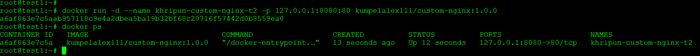

Переименовываем контейнер:
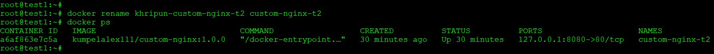

Вводим требуемые команды:
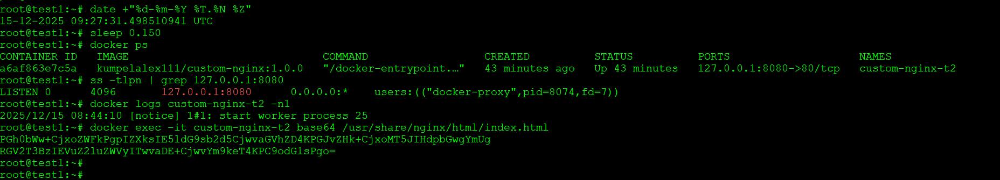

Поверяем, что страница доступна:
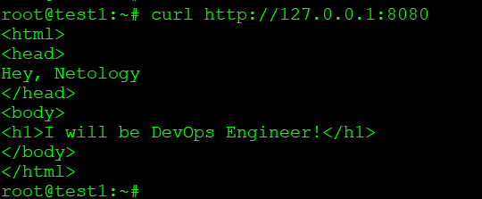

### Задание 3

Подключаемся к стандартному вводу-вывода контейнера командой **docker attach**. С помощью этой команды подключаемся к его основному процессу. Если после подключения нажать **Ctrl+C** (т.е. послать сигнал завершения процесса), то основной процесс контейнера остановится, а вместе с ним остановится и сам контейнер:
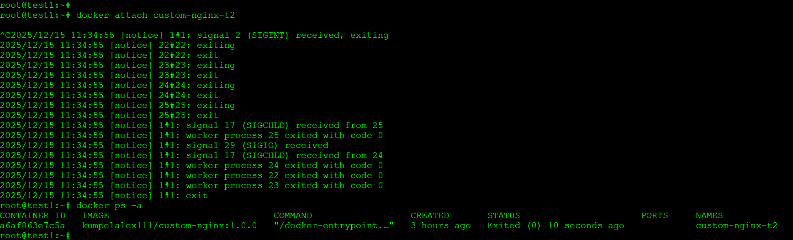

Запускаем снова контейнер, подключаемся и в файле конфигурации меняем порт, который слушает nginx с 80 на 81 и перезапускаем nginx командой **nginx -s reload**. Теперь страница недоступна по порту 80, но доступна по порту 81:
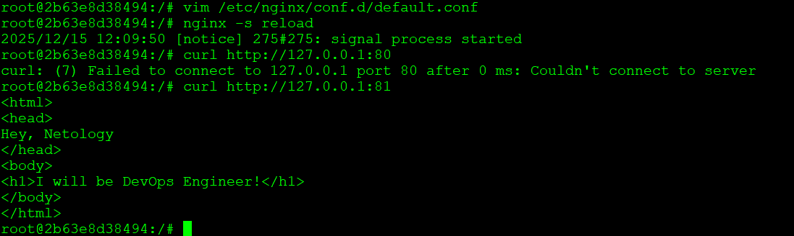

Выйдя из контейнера проверяем доступность страницы на порту 80:
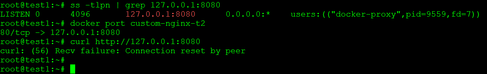

Страница недоступна. Это связано с тем, что в контейнер пробрасывается порт 80 (указано при запусе контейнера), но приложение внутри контейнера уже слушает порт 81.

Можно исправить ситуацию, не удаляя контейнер. Но придется его остановить (как и сам процесс Docker, что повлечет за собой остановку всех запущенных на хосте контейнеров). В каталоге /var/lib/docker/containers/<ID>/ нужно отредактировать два файла - hostconfig.json (файл конфигурации хоста) и config.v2.json.
В файле hostconfig.json, помимо прочего, находится mapping всех портов контейнера. Здесь нужно найти параметр **PortBindings** и нужно исправить порт 80 на 81:


Также нужно в файле config.v2.json в параметре **Config** найти ключ **ExposedPorts** и указать, что теперь контейнер слушает порт 81.
Проверяем:
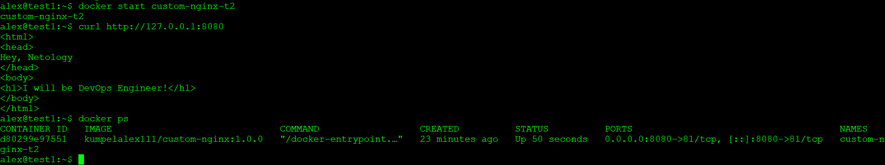

Удаляем запущенный контейнер без его установки командой:
```
docker rm -f custom-nginx-t2
```

### Задание 4

Запускаем два контейнера с образом Centos и Debian с проброшенным к ним внутрь в папку /data текущим каталогом хоста:
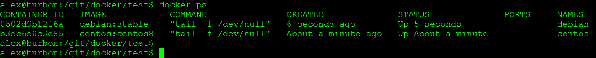

В контейнере Centos в папке /data создаем текстовый файл:
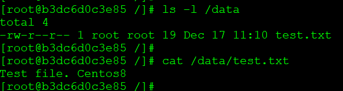

На хостовой машине добавим еще один текстовый файл. 
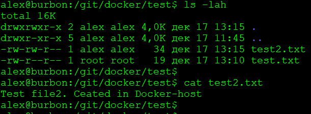

Подключаемся к контейнеру debian и проверяем наличие файлов:
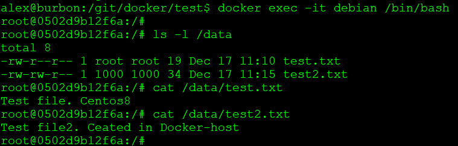

### Задание 5

При запуске docker compose если не указан файл для запуска, то по умолчанию используется файл compose.yaml. Чтобы использовать несколько конфигурационных файлов, их можно поместить в секцию **include** в файле compose.yaml:
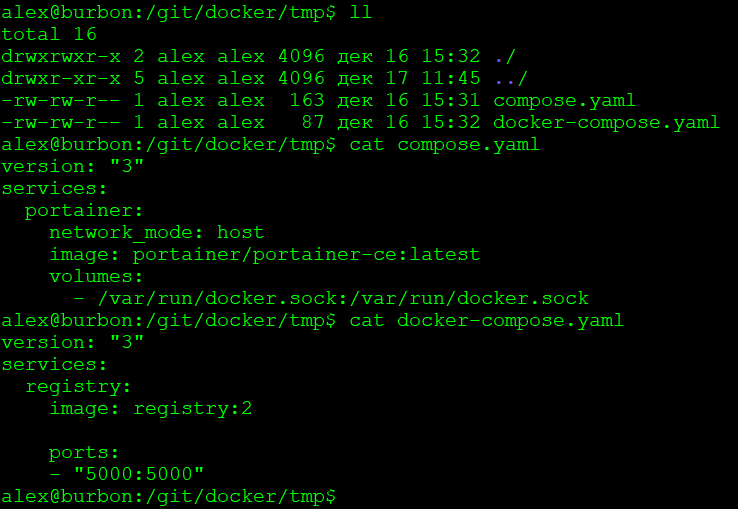


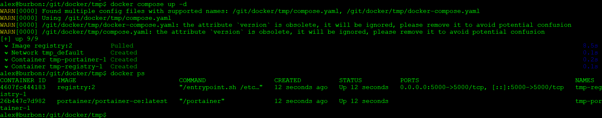

