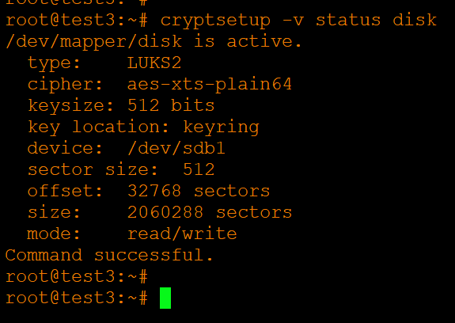
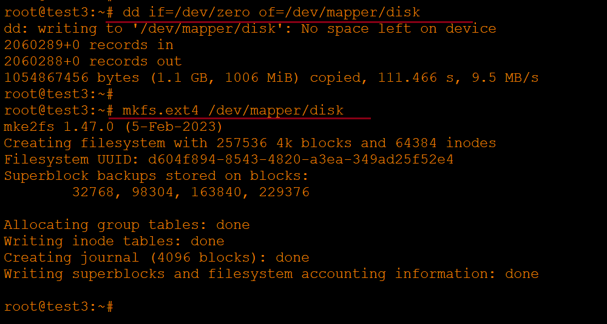
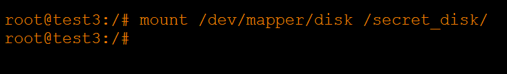
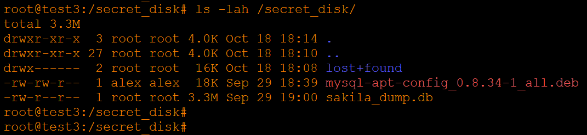

# Домашнее задание к занятию «Защита хоста» - Хрипун Алексей

---

### Задание 1

1. Установите eCryptfs.
2. Добавьте пользователя cryptouser.
3. Зашифруйте домашний каталог пользователя с помощью eCryptfs.

*В качестве ответа пришлите снимки экрана домашнего каталога пользователя с исходными и зашифрованными данными.*

### Решение 1


### Задание 2

1. Установите поддержку LUKS.
2. Создайте небольшой раздел, например, 100 Мб.
3. Зашифруйте созданный раздел с помощью LUKS.

*В качестве ответа пришлите снимки экрана с поэтапным выполнением задания.*

### Решение 2

1. В систему был добавлен новый жесткий диск. Нужно проверить, как он определился в системе:


Диск определился как sdb. Нужно создать на нет таблицу разделов, раздел и файловую систему:


2. Устанавливаем cryptsetup 
```
apt-get install cryptsetup
```

Далее нужно выполнить инициализацию раздела, установить ключ инициализации и пароль:
 

3. Открываем только что созданный раздел.


Можно проверить статус диска:


4. На свякий случай перезаписываем содержимое диска нолями, затем создаем файловую систему: 


5. Создаем каталог для монтирования диска:
```
mkdir /secret_disk
```
Монтируем диск:


6. На этом все. Диском можно пользоваться:
 


