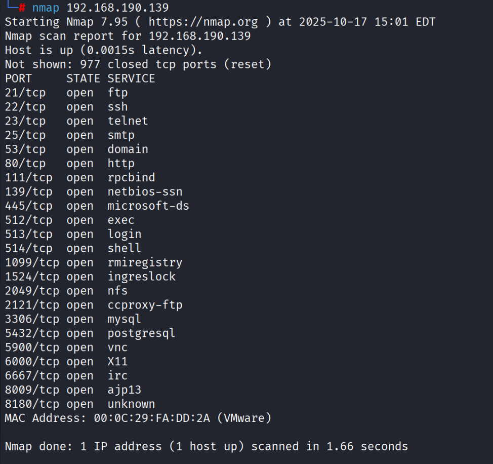
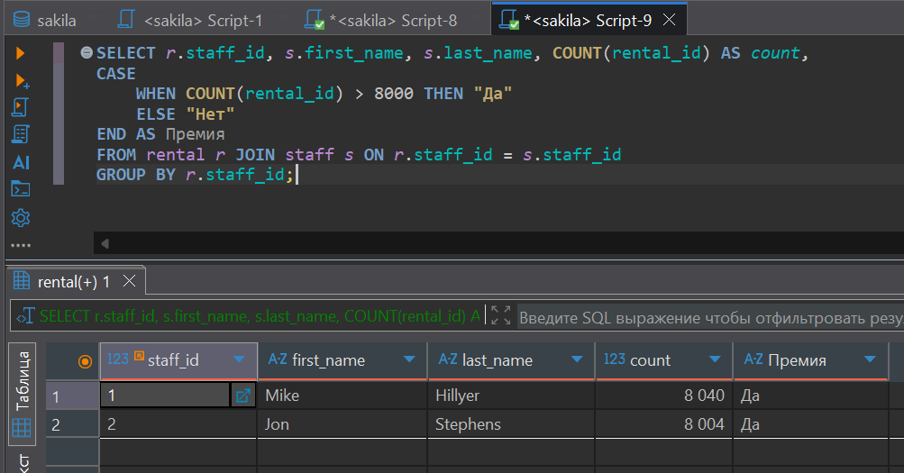
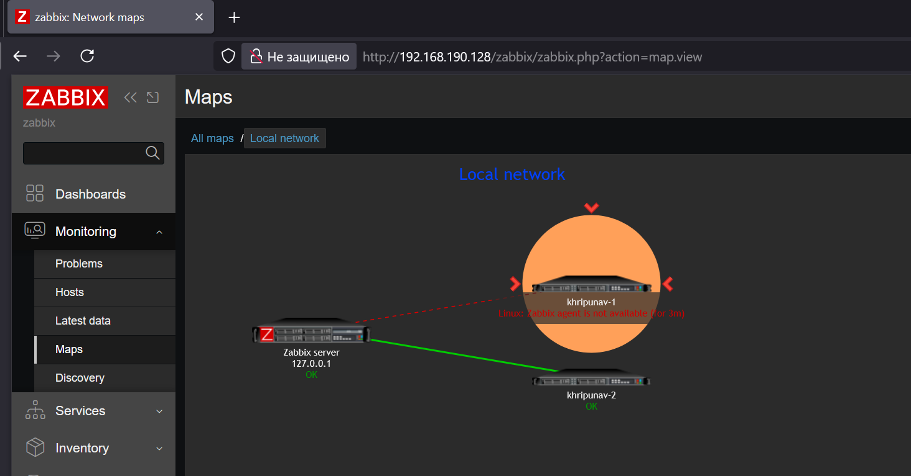
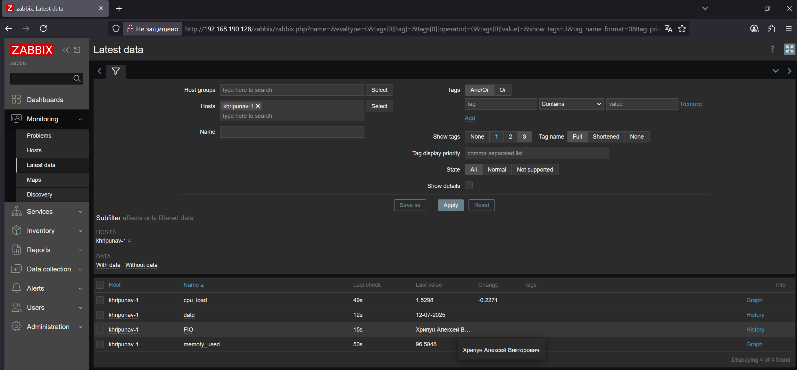
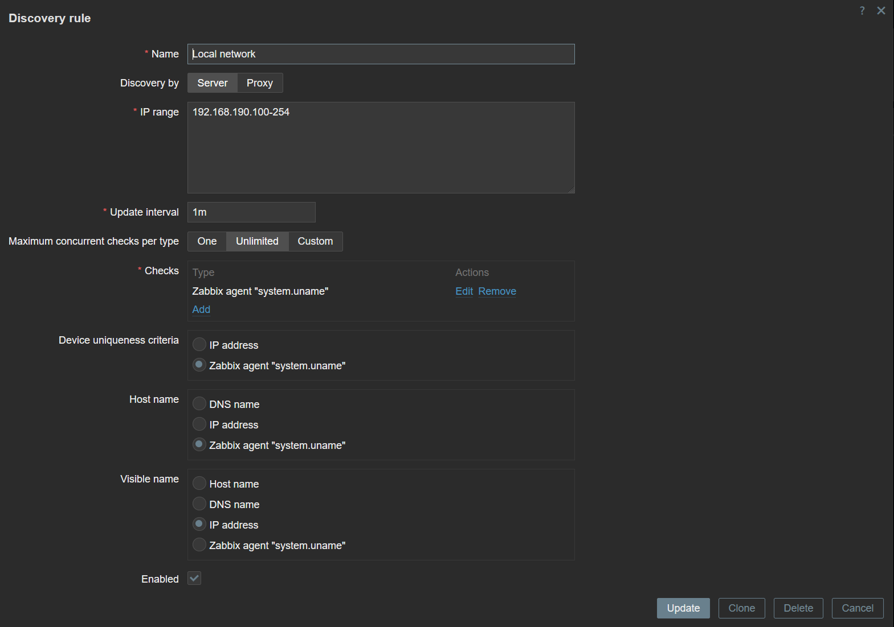
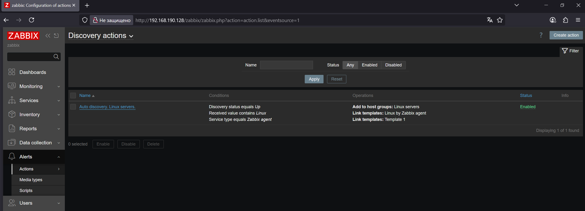

# Домашнее задание к занятию "`Система мониторинга Zabbix.Часть 2.`" - Хрипун Алексей

---

### Задание 1




---

### Задание 2 и задание 3


---

### Задание 4




---

### Задание 5




---

### Задание 6

Код скрипта
```
#!/bin/bash
if [ $1 -eq 1 ]; then
        echo "Хрипун Алексей Викторович"
elif [ $1 -eq 2 ]; then
        echo "$(date '+%d-%m-%Y')"
else
        echo "$1 - Неверный аргумент. Нужно ввести 1 или 2"
fi
```



---

### Задание 8






