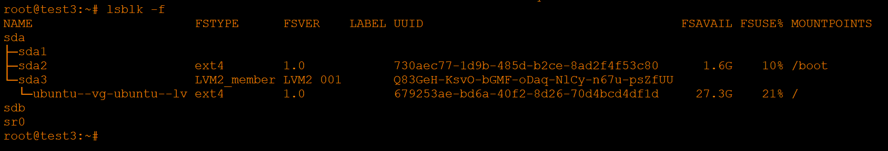

# Домашнее задание к занятию "`Домашнее задание к занятию 1 «Disaster recovery и Keepalived»`" - Хрипун Алексей

---

### Задание 1
`Исходная схема`


`На интерфейсах маршрутизатора настраиваем NHRP. Настройка Router1`

```
!
interface FastEthernet0/1
 ip address 192.168.0.2 255.255.255.0
 duplex auto
 speed auto
 standby version 2
 standby 0 ip 192.168.0.1
 standby 0 priority 105
 standby 0 preempt
 standby 0 track FastEthernet2/0
!
interface FastEthernet2/0
 ip address 192.168.1.2 255.255.255.0
 duplex auto
 speed auto
 standby version 2
 standby 1 ip 192.168.1.1
 standby 1 priority 50
 standby 1 preempt
 standby 1 track FastEthernet0/1
!
```
`Router 2:`
```
!
interface FastEthernet0/1
 ip address 192.168.0.3 255.255.255.0
 duplex auto
 speed auto
 standby version 2
 standby 0 ip 192.168.0.1
 standby 0 preempt
 standby 0 track FastEthernet2/0
!
interface FastEthernet2/0
 ip address 192.168.1.3 255.255.255.0
 duplex auto
 speed auto
 standby version 2
 standby 1 ip 192.168.1.1
 standby 1 preempt
 standby 1 track FastEthernet0/1
!
```
`Проверяем:`


`Пустим ping от PC0 на Server0 и посмотрим трафик между Switch1 и Router1. Видим, что на Server0 идут только echo request`


`Проверим трафик между Swith1 и Router2. Через него от Server0 возвращаются echo reply` 


`Симитируем прерывание канала связи между Switch1 и Router1 и снова проверим трафик между Switch1 и Router2. Теперь весь трафик идет через Router2`


`На Router2 для обоих групп интерфейсы стали активными:`


`После восстановления соединения между Switch1 и Router1 для группы 0 Router1 снова становится активным (команда preempt и более высокий приоритет)`

---

### Задание 2





---

### Задание 3


