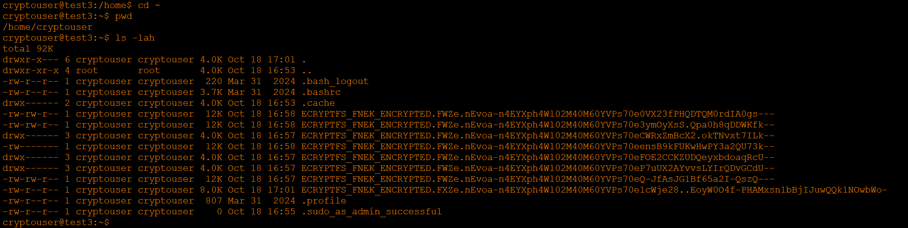

# Домашнее задание к занятию «Репликация и масштабирование. Часть 1» - Хрипун Алексей

---

## Задание 1
На лекции рассматривались режимы репликации master-slave, master-master, опишите их различия.

*Ответить в свободной форме.

### Решение 1
В топологии репликации master-slave (в новой терминологии source - replica) изменения вносятся на master и копируются на slave (при этом slave рекомендуется сделать read-only).

В топологии master - master (или source - source) изменения могут вноситься на любой из этих нод. Это настройка обычной master-slave репликации,
только в обе стороны. Каждый сервер является мастером и слейвом одновременно. Не рекомендуется использовать эту топологию.

## Задание 2
Выполните конфигурацию master-slave репликации, примером можно пользоваться из лекции.

*Приложите скриншоты конфигурации, выполнения работы: состояния и режимы работы серверов.

# Решение 2
Для настройки репликации на серверах master и slave нужно в файле my.cnf указать server_id (например, 1 и 2).  Для репликации использовалась база данных sakila. С сервера test3, который был выбран как master (source), был снят дамп этой базы данных командой:
```
mysqldump --databases sakila --source-data > sakila_dump.db
```
После восстановления дампа на сервере-реплике настроиваем репликацию. На сервере source нужно создать пользователя:


запоминаем бинарный лог-файл и позицию в нем:


Переходим на сервер-реплику и отключаем все запланированные задания (если они выполнятся на source, а потом повторно на реплике - может возникнуть ошибка):


Далее настраиваем репликацию:
```
CHANGE REPLICATION SOURCE TO SOURCE_HOST="test3",SOURCE_USER="repl",SOURCE_PASSWORD="P@ssw0rd",SOURCE_LOG_FILE="mysql-bin.000006",SOURCE_LOG_POS=158;

START REPLICA;
```

Проверяем репликацию:


На сервере master в таблицу actor была добавлена строка:
```
INSERT INTO actor (first_name, last_name) VALUES ("DONALD", "TRUMP");
```
Проверяем на сервере-реплике:


