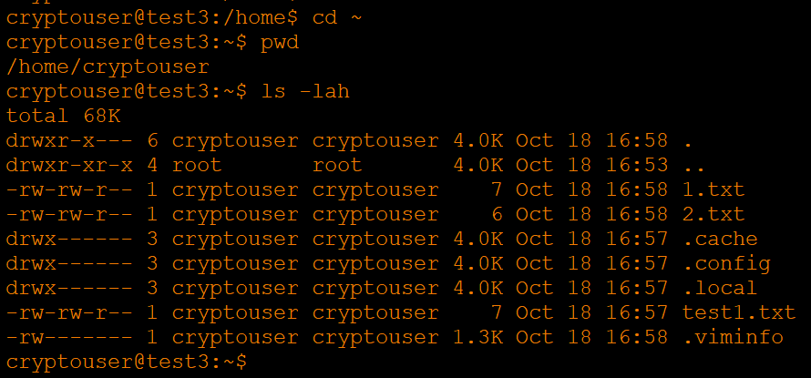
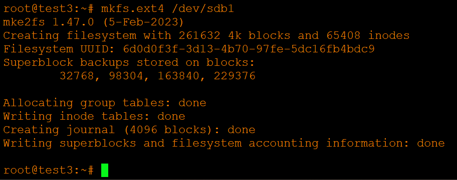

# Домашнее задание к занятию 3 «Резервное копирование» - Хрипун Алексей

---

### Задание 1


`Если из домашнего каталога удалить файл, например, file.test, в новой резервной копии его также не будет:`


 

### Задание 2

`Скрипт для ежедневного резервного копирования домашнего каталога. Для удобства мониторинга задания лог пишется не только в системный журнал, но и в отдельный лог-файл:`
```
#!/bin/bash
rsync -a --delete --checksum /home/fox/ /tmp/backup
if [[ $? -eq 0 ]]; then
        echo "$(date +"%Y-%m-%dT%H:%M:%S.%6N")       $HOSTNAME   Backup for the fox user has been completed" | tee -a /var/log/syslog  >> /var/log/backup_home_fox.txt
else
        echo "$(date +"%Y-%m-%dT%H:%M:%S.%6N")       $HOSTNAME   Backup FAILED for the fox user" | tee -a /var/log/syslog >> /var/log/backup_home_fox.txt
fi
```


`Результат выполнения скрипта пишется в лог-файлы. При одном из запусков быз изменен каталог для копирования. Неудачный запуск также попал в лог файлы:`


`После отладки скрипта он был поставлен на ежедневное выполнение с помощью cron`


[Запуск по расписанию](https://github.com/kumpelalex111/cicd-47/blob/main/root)


### Задание 3


### Задание 4
`Скрипт для создания резервной копии пользователя. Папка с ключами не резервируется`
```
#!/bin/bash
SOURCE="fox@192.168.190.130:/home/fox/"
DATE_BACKUP=$(date +"%d-%m-%Y-%H-%M-%S")
DEST="/backup/${DATE_BACKUP}"
KEY="/home/alex/.ssh/rock_ed25519"
LAST_BACKUP=$(cat /distrib/last_backup)

rsync -a -v --delete --checksum --exclude="/.ssh/" --link-dest=/backup/${LAST_BACKUP} -e "ssh -i $KEY" $SOURCE  $DEST
if [[ $? -eq 0 ]]; then
        echo "${DATE_BACKUP}" > /distrib/last_backup # сохраняем дату предыдущего backup
        find /backup -maxdepth 1 -type d -ctime +5 | xargs rm -r # удаляем старые бекапы
else
        echo "Backup failed"
        exit 1
fi
```
[Запуск по расписанию](https://github.com/kumpelalex111/cicd-47/blob/main/root)


`Скрипт для восстановления резервной копии на заданную дату:`
```
#!/bin/bash

SOURCE="/backup/$1/"
DEST="fox@192.168.190.130:/home/fox"
KEY="/home/alex/.ssh/rock_ed25519"

rsync -a -e "ssh -i $KEY" $SOURCE  $DEST
```
[Запуск по расписанию](https://github.com/kumpelalex111/cicd-47/blob/main/root)


