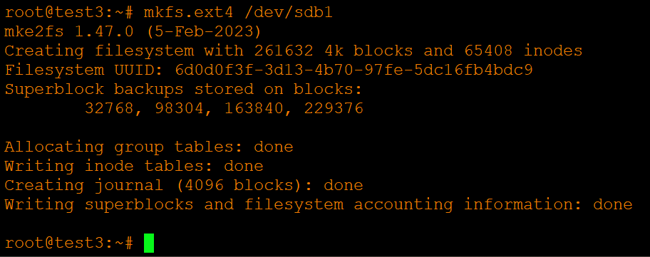
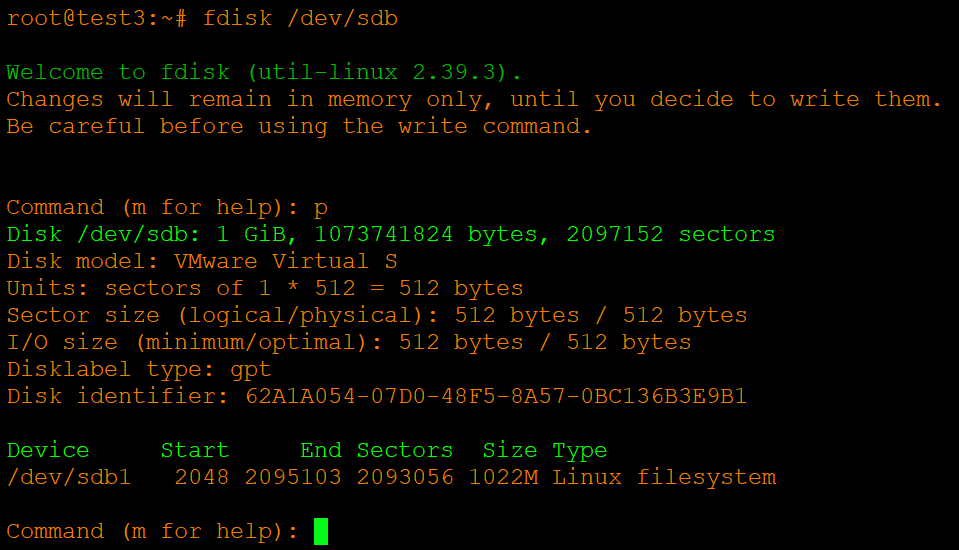

# Домашнее задание к занятию «Репликация и масштабирование. Часть 2» - Хрипун Алексей

---

## Задание 1
Опишите основные преимущества использования масштабирования методами:

* активный master-сервер и пассивный репликационный slave-сервер;
* master-сервер и несколько slave-серверов;

*Дайте ответ в свободной форме.*

### Решение 1
master-slave - это классическая схема, в которой master отвечает за все операции записи, а slave получает копии этих изменений и служит для чтения данных. Преимущества такой репликации:
- разргрузка master (чтение можно распределить по нескольким slave, что повышает производительность)
- резервирование - если master вышел из строя, можно переключиться на slave

В случае если slave-серверов несколько, то появляется еще и масштабируемость (можно добавлять новые slave без переззагрузки основного сервера). Кроме того, одну из реплик можно настроить на синхронную репликацию, остальные на асинхронную (просадка по скорости будет незначительная и всегда будут доступны последние данные).

## Задание 2
Разработайте план для выполнения горизонтального и вертикального шаринга базы данных. База данных состоит из трёх таблиц:

* пользователи,
* книги,
* магазины (столбцы произвольно).
Опишите принципы построения системы и их разграничение или разбивку между базами данных.

*Пришлите блоксхему, где и что будет располагаться. Опишите, в каких режимах будут работать сервера.*

### Решение 2
Исходнве таблицы

**Горизонтальный шардинг** - хороший вариант, когда основная проблема - огромное количество строк в таблицах и высокая нагрузка на чтение/запись:

Для равномерного наполнения шард можно использовать HASH-шардирование. Также можно использовать алгоритм TAG - этот алгоритм отправляет в один шард все строки или столбцы, соответствующие когкретному значению. Например, можно разедить все строки на четные (отправляем в shard 1) и нечетные (отправляем в shard 2)  

**Вертикальный шардинг** полезен, когда у тбалицы очень много столбцов.

